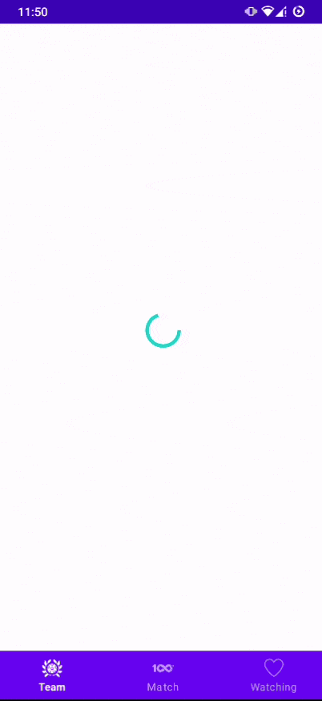

## Table of Contents

- [Introduction](#introduction)
- [Features](#features)
- [Architecture](#architecture)
- [Demo](#demo)

## Introduction
- Demonstration application for LiveScore

## Features

List of features that build in this app

* Show all participating team
* Show all previous and upcoming matches
* View team detail with previous matches and upcoming matches of that team
* View match detail with highlight
* Add match to watchlist
* Manage watchlist matches (remove/add)
* Create notification for watching match

-> Improve things will do
* Show watching match indicator in team detail screen also all match screen.

## Architecture

* Clean architecture with MVVM model
* UI layer -> Data layer[Repository -> [RemoteSource, LocalSource]]

## Tech-Stack
* Kotlin Coroutine, Flow 
* Jetpack Navigation
* Jetpack Room
* Koin
* Kotlin-Serialization
* Ktor
* Coil
* ExoPlayer

## Demo

